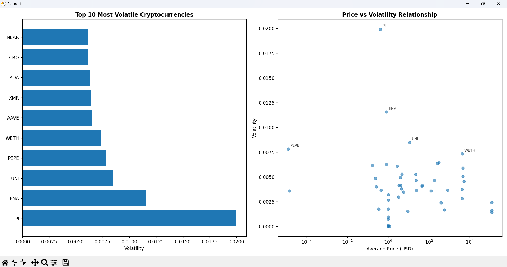
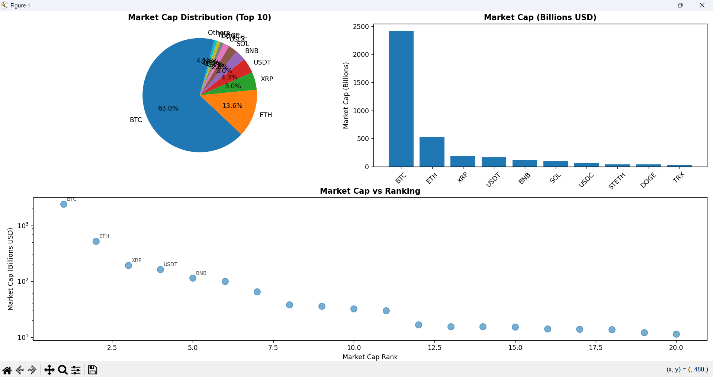

# 🚀 Cryptocurrency Price Tracker

<div align="center">


*A comprehensive cryptocurrency price tracking and analysis tool with automated data collection, volatility analysis, and beautiful visualizations.*

[Features](#-features) • [Installation](#-installation) • [Quick Start](#-quick-start) • [Usage](#-usage) • [Screenshots](#-screenshots) • [Contributing](#-contributing)

</div>

---

## 🌟 Features

### 📊 **Data Collection & Storage**
- **Real-time data** from CoinGecko API (100+ cryptocurrencies)
- **SQLite database** for persistent storage
- **Automated scheduling** for daily/hourly collection
- **Historical data** tracking with timestamps
- **No API key required** - completely free to use

### 📈 **Advanced Analytics**
- **Price volatility analysis** using statistical methods
- **Market cap rankings** and distribution
- **Top gainers/losers** identification
- **Time series analysis** for trend detection
- **Performance metrics** (24h, 7d changes)

### 🎨 **Rich Visualizations**
- **Interactive price charts** with multiple timeframes
- **Volatility heatmaps** and scatter plots
- **Market cap distribution** pie charts
- **Gainers/losers** horizontal bar charts
- **Correlation matrices** between cryptocurrencies
- **Export-ready** high-quality plots

### 🤖 **Automation**
- **Scheduled data collection** (customizable intervals)
- **Background processing** capabilities
- **Error handling** and retry mechanisms
- **Comprehensive logging** system
- **Database optimization** with indexing

---

## 🚀 Installation

### Prerequisites
- Python 3.8 or higher
- Internet connection for API calls

### 1. Clone the Repository
```bash
git clone https://github.com/yourusername/crypto-price-tracker.git
cd crypto-price-tracker
```

### 2. Install Dependencies
```bash
pip install -r requirements.txt
```

### 3. Verify Installation
```bash
python test_tracker.py
```

---

## ⚡ Quick Start

### 🎮 **Instant Demo (2 minutes)**
Get immediate results with sample data:
```bash
python immediate_demo.py
```

### 📊 **First Data Collection**
```python
from crypto_tracker import CryptoPriceTracker

# Initialize tracker
tracker = CryptoPriceTracker()

# Collect data for top 50 cryptocurrencies
tracker.daily_data_collection()

# Generate visualizations
tracker.visualize_price_trends(['BTC', 'ETH', 'ADA', 'DOT'], days=7)
```

### 🔄 **Automated Collection**
```bash
# Start automated daily collection
python daily_collector.py
```

---

## 💻 Usage

### Basic Commands

#### **Data Collection**
```python
# Manual data collection
tracker = CryptoPriceTracker()
tracker.daily_data_collection()

# Get specific cryptocurrency data
btc_data = tracker.get_price_history('BTC', days=30)
```

#### **Visualizations**
```python
# Price trends
tracker.visualize_price_trends(['BTC', 'ETH', 'BNB'], days=14)

# Market analysis
tracker.market_cap_analysis()

# Volatility analysis
volatility_data = tracker.analyze_volatility(days=30)

# Top performers
tracker.visualize_gainers_losers()
```

#### **Data Export**
```python
# Export to CSV
df = tracker.get_all_data(days=30)
df.to_csv('crypto_data.csv', index=False)

# Generate comprehensive report
tracker.generate_report(days=7)
```

### Advanced Usage

#### **Custom Scheduling**
```python
import schedule

# Collect every 6 hours
schedule.every(6).hours.do(tracker.daily_data_collection)

# Collect at specific times
schedule.every().day.at("09:00").do(tracker.daily_data_collection)
schedule.every().day.at("21:00").do(tracker.daily_data_collection)
```

#### **Portfolio Tracking**
```python
# Track specific cryptocurrencies
my_portfolio = ['BTC', 'ETH', 'ADA', 'DOT', 'LINK']
for symbol in my_portfolio:
    data = tracker.get_price_history(symbol, days=30)
    print(f"{symbol}: ${data['price_usd'].iloc[-1]:.2f}")
```

---

## 📸 Screenshots

### 📈 Price Trend Analysis
*Line charts showing price movements over time with percentage changes*


### 🏆 Top Gainers & Losers
*Horizontal bar charts highlighting best and worst performers*


### 📊 Market Cap Distribution
*Pie charts and scatter plots showing market capitalization analysis*


### 🌡️ Volatility Heatmap
*Advanced volatility analysis with statistical metrics*


---

## 🛠️ Configuration

### Database Settings
```python
# Custom database location
tracker = CryptoPriceTracker(db_path="custom_crypto.db")

# Performance optimization
tracker.setup_database()  # Reinitialize with optimized indices
```

### API Configuration
```python
# Adjust data collection limits
crypto_data = tracker.fetch_crypto_data(limit=200)  # Top 200 cryptocurrencies

# Custom API parameters
tracker.base_url = "https://api.coingecko.com/api/v3"
```

### Visualization Customization
```python
import matplotlib.pyplot as plt
import seaborn as sns

# Set custom style
plt.style.use('dark_background')
sns.set_palette("husl")

# Custom figure size
plt.figure(figsize=(20, 12))
```

---

## 📊 Sample Output

```
🚀 CRYPTOCURRENCY MARKET REPORT - LAST 7 DAYS
============================================================

TOP 5 GAINERS (24h):
----------------------------------------
1. SOL (Solana): +12.45%
2. ADA (Cardano): +8.23%
3. AVAX (Avalanche): +7.91%
4. MATIC (Polygon): +6.54%
5. DOT (Polkadot): +5.67%

TOP 5 LOSERS (24h):
----------------------------------------
1. LUNA (Terra Luna): -15.23%
2. FTT (FTX Token): -9.87%
3. SHIB (Shiba Inu): -7.45%
4. DOGE (Dogecoin): -6.12%
5. TRX (TRON): -4.89%

VOLATILITY ANALYSIS:
----------------------------------------
Most volatile cryptocurrencies:
- SHIB: 0.0892
- DOGE: 0.0745
- ADA: 0.0623

============================================================
```

---

## 📋 Project Structure

```
crypto-price-tracker/
├── 📁 src/
│   ├── 📄 crypto_tracker.py      # Main tracker class
│   ├── 📄 daily_collector.py     # Automated collection
│   ├── 📄 immediate_demo.py      # Quick demo script
│   └── 📄 test_tracker.py        # Testing utilities
├── 📁 data/
│   └── 📄 crypto_prices.db       # SQLite database
├── 📁 exports/
│   ├── 📄 crypto_data.csv        # Exported data
│   └── 📁 charts/                # Generated visualizations
├── 📁 docs/
│   ├── 📄 API_DOCUMENTATION.md   # API reference
│   └── 📄 TROUBLESHOOTING.md     # Common issues
├── 📄 requirements.txt           # Python dependencies
├── 📄 README.md                  # This file
└── 📄 LICENSE                    # MIT license
```

---

## 🔧 Troubleshooting

### Common Issues

#### **API Rate Limiting**
```bash
# Error: Too many requests
# Solution: Add delays between requests
time.sleep(6)  # 6 second delay
```

#### **Database Locked**
```bash
# Error: Database is locked
# Solution: Ensure single process access
conn.close()  # Always close connections
```

#### **Missing Data**
```python
# Check data availability
df = tracker.get_all_data(days=1)
if df.empty:
    print("No data available - run data collection first")
```

#### **Visualization Errors**
```python
# Install additional backend for matplotlib
pip install PyQt5  # or pip install tkinter
```

### Performance Optimization

#### **Database Indexing**
```sql
CREATE INDEX idx_symbol_timestamp ON price_data(symbol, timestamp);
CREATE INDEX idx_market_cap ON price_data(market_cap);
```

#### **Memory Management**
```python
# Process data in chunks for large datasets
chunk_size = 1000
for chunk in pd.read_sql(query, conn, chunksize=chunk_size):
    process_chunk(chunk)
```

---

## 🚀 Advanced Features

### **Technical Indicators**
```python
def add_moving_averages(df, windows=[7, 21, 50]):
    for window in windows:
        df[f'MA_{window}'] = df['price_usd'].rolling(window=window).mean()
    return df
```

### **Price Alerts**
```python
def setup_price_alert(symbol, target_price, email):
    current_price = get_latest_price(symbol)
    if current_price >= target_price:
        send_email_alert(email, f"{symbol} reached ${target_price}")
```

### **Portfolio Performance**
```python
def calculate_portfolio_value(holdings):
    total_value = 0
    for symbol, amount in holdings.items():
        current_price = get_latest_price(symbol)
        total_value += current_price * amount
    return total_value
```

---

## 🤝 Contributing

We welcome contributions! Here's how you can help:

### **Ways to Contribute**
- 🐛 **Bug Reports**: Found an issue? [Open an issue](https://github.com/rakshittttt/crypto-price-tracker/issues)
- ✨ **Feature Requests**: Have an idea? [Request a feature](https://github.com/rakshittttt/crypto-price-tracker/issues)
- 📝 **Documentation**: Improve our docs
- 💻 **Code**: Submit pull requests

### **Development Setup**
```bash
# Fork the repository
git clone https://github.com/yourusername/crypto-price-tracker.git
cd crypto-price-tracker

# Create virtual environment
python -m venv venv
source venv/bin/activate  # On Windows: venv\Scripts\activate

# Install development dependencies
pip install -r requirements-dev.txt

# Run tests
python -m pytest tests/
```

### **Pull Request Guidelines**
1. Fork the repo and create your branch from `main`
2. Add tests for new functionality
3. Ensure all tests pass
4. Update documentation as needed
5. Submit a pull request with a clear description

---

## 📈 Roadmap

### **Version 2.0** 🎯
- [ ] Web dashboard with Flask/Streamlit
- [ ] Real-time WebSocket data feeds
- [ ] Advanced technical indicators (RSI, MACD, Bollinger Bands)
- [ ] Machine learning price predictions
- [ ] Mobile-responsive interface

### **Version 2.1** 🚀
- [ ] Multi-exchange price comparison
- [ ] DeFi protocol integration
- [ ] NFT market tracking
- [ ] Social sentiment analysis
- [ ] Telegram/Discord bot integration

### **Future Enhancements** 💫
- [ ] Portfolio optimization algorithms
- [ ] Tax reporting features
- [ ] API rate limiting with Redis
- [ ] Docker containerization
- [ ] Cloud deployment options

---
## 📸 Screenshots

### 📈 Price Trend Analysis


### 🏆 Top Gainers & Losers  


### 📊 Market Cap Distribution


### 🌡️ Volatility Analysis


---


## 📄 License

This project is licensed under the MIT License - see the [LICENSE](LICENSE) file for details.

```
MIT License

Copyright (c) 2024 Crypto Price Tracker

Permission is hereby granted, free of charge, to any person obtaining a copy
of this software and associated documentation files (the "Software"), to deal
in the Software without restriction, including without limitation the rights
to use, copy, modify, merge, publish, distribute, sublicense, and/or sell
copies of the Software...
```

---

## 🙏 Acknowledgments

- **[CoinGecko](https://www.coingecko.com/)** - Free cryptocurrency API
- **[Pandas](https://pandas.pydata.org/)** - Data manipulation library
- **[Matplotlib](https://matplotlib.org/)** - Plotting library
- **[Seaborn](https://seaborn.pydata.org/)** - Statistical visualizations
- **[Schedule](https://schedule.readthedocs.io/)** - Job scheduling library

---


